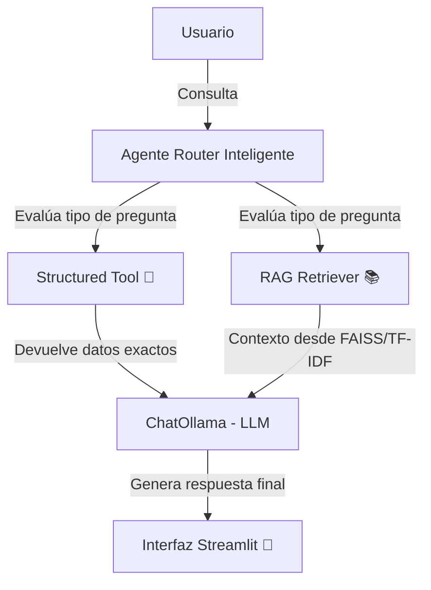
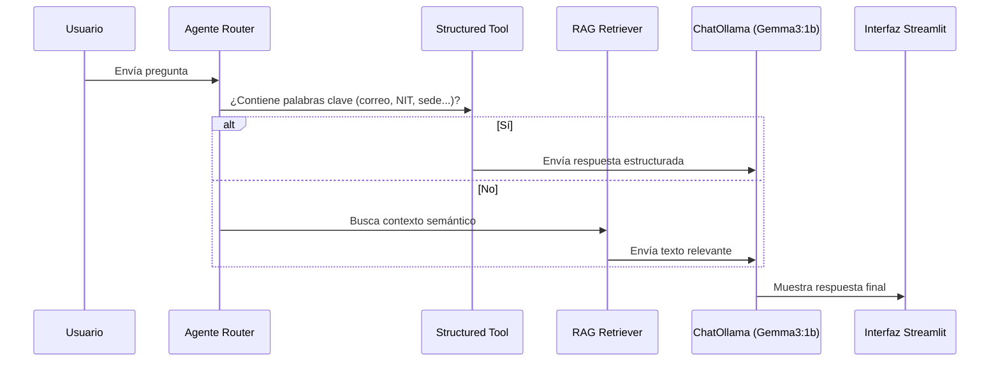
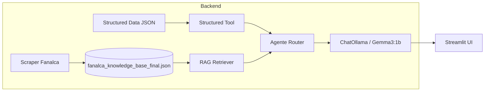

# Chatbot Corporativo – Fanalca Bot

_Asistente virtual inteligente basado en RAG (Retrieval-Augmented Generation) y datos estructurados de Fanalca S.A._

---

## Descripción General

**Fanalca Bot** es un asistente virtual desarrollado para responder preguntas relacionadas exclusivamente con la empresa **Fanalca S.A.**, integrando dos enfoques complementarios:

1. **RAG (Retrieval-Augmented Generation)** — utiliza una base vectorial TF-IDF para recuperar fragmentos de texto desde fuentes oficiales del sitio web de Fanalca.
2. **Structured Data Tool** — maneja información concreta (NIT, correos, direcciones, redes, horarios, etc.) mediante un JSON estructurado.

El proyecto combina **procesamiento de lenguaje natural**, **recuperación semántica** y **enrutamiento inteligente**, garantizando respuestas precisas, actualizadas y alineadas con la identidad corporativa de Fanalca.

---

## Arquitectura General del Sistema



El agente Router decide dinámicamente si una consulta debe ser resuelta por:

- **Structured Tool** (consultas específicas, datos exactos)
- **RAG Retriever** (consultas abiertas o explicativas)

---

## Tecnologías Utilizadas

| Componente | Tecnología / Librería | Función |
|-------------|----------------------|----------|
| **Frontend** | Streamlit | Interfaz web interactiva y adaptable |
| **Agente LLM** | LangGraph + ChatOllama | Control de flujo conversacional con modelos locales |
| **Modelo Base** | Gemma3:1b (Ollama) | Generación natural del lenguaje |
| **RAG Retriever** | scikit-learn (TF-IDF + cosine similarity) | Búsqueda semántica vectorial |
| **Structured Tool** | JSON + Python | Base estructurada de datos corporativos |
| **Web Scraper** | BeautifulSoup4, requests, tldextract, PyMuPDF | Extracción automatizada de texto del sitio oficial |
| **Persistencia** | Archivos .json | Almacenamiento del conocimiento |
| **Infraestructura** | dotenv, uuid, typing, tqdm | Configuración, tipos y seguimiento de progreso |

---

## Módulos del Proyecto

### 1. `app.py`
Archivo principal del proyecto. Implementa la interfaz de usuario con **Streamlit**, define la lógica del chatbot, el enrutamiento entre herramientas y el flujo conversacional.

Integra:
- ChatOllama para invocar el modelo LLM local.
- FanalcaRetriever (RAG vectorial).
- FanalcaStructuredTool (datos estructurados).
- Enrutador con prompt especializado que selecciona la herramienta correcta según la consulta.

El sistema incluye un control de temperatura ajustable en la barra lateral para balancear precisión vs. creatividad.

---

### 2. `retriever.py`
Implementa el motor de búsqueda semántica basado en **TF-IDF** y **cosine similarity**.
Convierte los textos extraídos del sitio web de Fanalca en vectores numéricos y genera el contexto relevante para el LLM.

Flujo:
1. Carga `fanalca_knowledge_base_final.json`.
2. Limpia y vectoriza textos.
3. Busca los más similares a la consulta.
4. Devuelve un bloque contextual listo para el prompt del modelo.

---

### 3. `structured_tool.py`
Módulo para consultas concretas sobre información verificable.
Opera sobre `structured_data.json` y responde con mensajes preformateados (correo, NIT, dirección, redes, etc.).

```python
tool.get_info("¿Cuál es el correo de atención al cliente?")
# ✉️ El correo de atención al cliente es servicioalcliente@fanalca.com.
```

---

### 4. `scrape_fanalca_full.py`
Script de **web scraping completo**.
Recorre todo el sitio oficial de Fanalca (https://fanalca.com/) hasta nivel 2 de profundidad, extrayendo contenido textual y metadatos de cada página.

Funciones clave:
- `limpiar_texto(html)` → limpia etiquetas HTML.
- `scrape_profundo()` → recorre enlaces internos y recopila información.
- `scrape_pdfs()` → descarga e interpreta archivos PDF usando PyMuPDF.

---

### 5. `structured_data.json`
Contiene la información estructurada y verificada de la empresa Fanalca S.A., incluyendo NIT, dirección, sedes, horario, servicio al cliente y redes sociales.

```json
{
  "empresa": "Fanalca S.A.",
  "nit": "890.300.237-8",
  "telefono_principal": "(602) 489 3131",
  "direccion_principal": "Calle 13 #31A - 80, Acopi Yumbo, Valle del Cauca, Colombia"
}
```

---

### 6. `fanalca_knowledge_base_final.json`
Base de conocimiento textual construida a partir del scraping oficial de Fanalca. Incluye páginas de historia, misión, visión, sostenibilidad, negocios, fundación, noticias, vacantes, contacto, etc.  
Esta base es utilizada por el **RAG Retriever** para contextualizar respuestas semánticas.

---

### 7. `unificar.py`
Script utilitario que combina múltiples archivos JSON de conocimiento (bases parciales o extendidas) en una sola versión unificada (`fanalca_knowledge_base_final.json`), eliminando duplicados.

---

## Flujo de Ejecución del Chatbot



---

## Ejemplo de Consulta

| Tipo de Pregunta | Herramienta Usada | Respuesta Esperada |
|------------------|------------------|--------------------|
| “¿Cuál es el NIT de Fanalca?” | Structured Tool | 🔢 El NIT de Fanalca S.A. es 890.300.237-8. |
| “¿Cuál es la visión de la empresa?” | RAG Retriever | Explica la visión basada en el texto de “Por qué trabajar en Fanalca”. |
| “¿Qué unidades de negocio tiene Fanalca?” | RAG Retriever | Honda Motos, Honda Autos, Autopartes, Tubería y Perfiles, Ambiental, Fanalvías. |
| “¿Dónde queda la sede principal?” | Structured Tool | 📍 Calle 13 #31A-80, Acopi Yumbo, Valle del Cauca. |

---

## Instalación y Ejecución

### 1️⃣ Clonar el repositorio
```bash
git clone https://github.com/CamiloPE12/Botfa.git
cd Botfa
```

### 2️⃣ Crear entorno virtual
```bash
uv venv
uv pip install -r requirements.txt
```

### 3️⃣ Ejecutar el chatbot
```bash
streamlit run app.py
```

---

## 🧩 Dependencias Principales

```text
streamlit
langchain-ollama
langgraph
scikit-learn
beautifulsoup4
tldextract
pymupdf
requests
python-dotenv
tqdm
```

---

##  Diagrama Interno de Componentes



---

##  Principales Características Técnicas

- Arquitectura modular: separación entre scraping, recuperación, estructuración y front-end.  
-  Agente Router Inteligente: decide dinámicamente el mejor método de respuesta.  
- control de dominio: restringido exclusivamente a información de Fanalca.  
- RAG basado en TF-IDF: respuestas semánticas sin necesidad de embeddings externos.  
- Base local JSON + FAISS: almacenamiento y búsqueda optimizados.  
- Interfaz estilo ChatGPT en Streamlit, con historial persistente.  
- Modelo local Ollama: evita dependencia de APIs externas.  

---

##  Autor

**Juan Camilo Peña Erazo**  
Profesor de Desarrollo de Software – Área Técnica  
Cali, Colombia 🇨🇴   
[GitHub: CamiloPE12](https://github.com/CamiloPE12)
